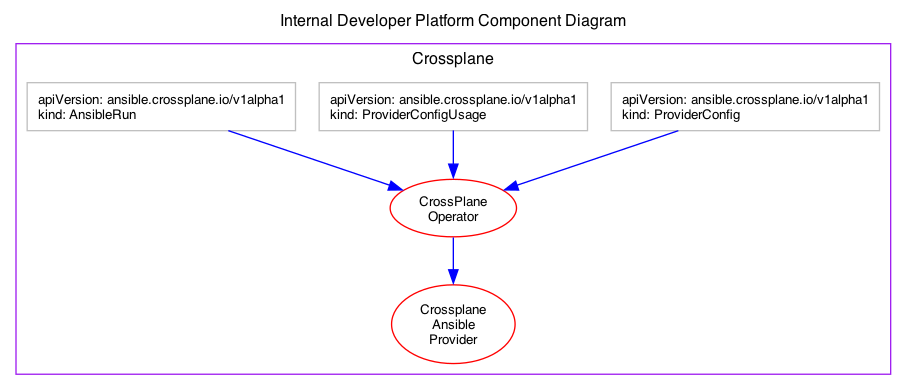
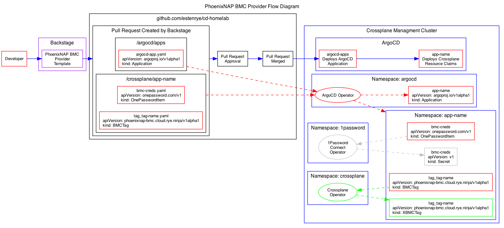

# 6. Build an IDP using Backstage, Crossplane, and PhoenixNAP BMC

Date: 2023-05-26

## Status

In Design

## Context

To demonstrate the value of an Internal Development Platform (IDP)
this project will provide an IDP that allows for the provisioning of
bare metal servers using the PhoenixNAP BMC.

### Prior Art

| Date | YouTube URL | Presenter | Event |
| --- | --- | --- | --- |
| 2021-10-29 | [Shifting Spotify Engineering from Spreadsheets to Backstage](https://www.youtube.com/watch?v=lCgDiusuixM) | Johan Haals & Patrik Oldsberg, Spotify | KubeCon CloudNativeCon North America 2021 |
| 2022-05-30 | [GitOps Infrastructure with Backstage + Crossplane + ArgoCD](https://www.youtube.com/watch?v=Ii-lpLuzPxw) | Diego Luisi | N/A |
| 2022-06-01 | [Crossplane Intro & Deep Dive - Compose Your Custom Cloud Platform](https://youtu.be/xECc7XlD5kY) | Jared Watts, Steven Borreli, Yury Tsarev, Christopher Haar | KubeCon + CloudNativeCon North America 2022 |
| 2022-06-09 | [The only thing that matters in DevOps is...](https://www.youtube.com/watch?v=raMMRFlOrFs) | Viktor Farcic | PlatformCon 2022 |
| 2022-06-09 | [How to build an IDP with Backstage, Crossplane and Argo CD](https://www.youtube.com/watch?v=d2L6PWGfhXI) | Viktor Farcic | PlatformCon 2022 |
| 2022-06-26 | [How to improve the development journey in your company with Backstage.](https://youtu.be/qFP_CcLp0Ao) | Diego Luisi | N/A |
| 2023-01-23 | [Viktor Farcic – DevOps Is All About Building Internal Developer Platform (IDP)](https://www.youtube.com/watch?v=U9zoxETp7XY) | Viktor Farcic | DevOps Barcelona Conference |
| 2023-05-15 | [How To Create A Complete Internal Developer Platform (IDP)?](https://www.youtube.com/watch?v=Rg98GoEHBd4) | Viktor Farcic | N/A |

### References

- [Generating a Crossplane Provider](https://github.com/upbound/upjet/blob/main/docs/generating-a-provider.md)

## Decision

Design and implement an Internal Development Platform Workshop for a conference
talk submission.

## Architecture Diagram

## Core Components

### Backstage

|     |     |
| --- | --- |
| Project Website | [backstage.io](http://backstage.io) |
| Project Github  | [github.com/backstage/backstage](https://github.com/backstage/backstage) |
| Project Docs    | [backstage.io/docs](https://backstage.io/docs) | 

Backstage will be the frontend developer portal that allows a developer to
provision a bare metal server on the PhoenixNAP Bare Metal Cloud (BMC).

### Crossplane

|     |     |
| --- | --- |
| Project Website | [crossplane.io](https://crossplane.io)
| Project Github | [github.com/crossplane/crossplane](https://github.com/crossplane/crossplane) |
| Project Docs | [docs.crossplane.io](https://docs.crossplane.io/) |
| Project Marketplace | [marketplace.crossplane.io](https://marketplace.upbound.io/) |

Crossplane will be the desired state controller that manages the provisioning and
destruction of resources on the PhoenixNAP Bare Metal Cloud (BMC).

#### Crossplane Providers

| Provider | Github |
| --- | --- |
| [Ansible Provider](https://marketplace.upbound.io/providers/crossplane-contrib/provider-ansible) | [crossplane-contrib/provider-ansible](https://github.com/crossplane-contrib/provider-ansible) |

#### Installation Notes

- Installed Crossplane provider.
- Installed Ansible provider.

## Consequences

- [ ] Identify what tools, components and architecture will be used to build an IDP.
- [ ] Document a proposed architecture.
- [ ] Write an RFP document for a conference workshop.
