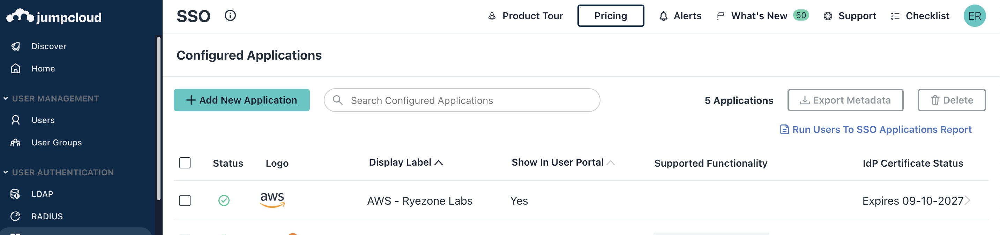
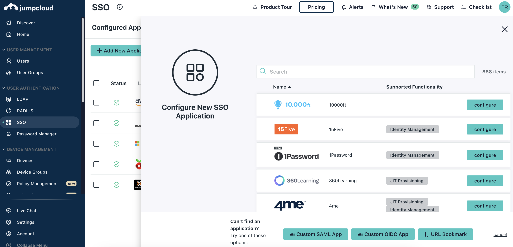
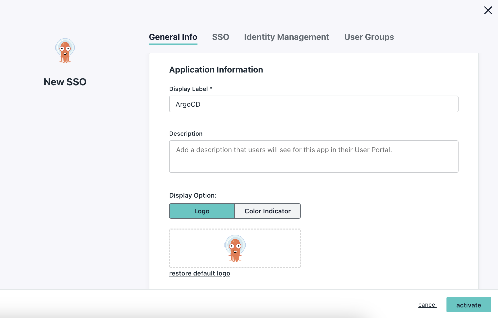

# 8. Authenticate Users to ArgoCD using JumpCloud OIDC

Date: 2023-06-18

## Status

Accepted

## Context

Access to ArgoCD needs to be authenticated as it has root access to the cluster
for which it manages deployment.  I use JumpCloud as my cloud directory service.
JumpCloud provides a SAML and OIDC SSO service out of the box.  I would like to 
utilize this service to authenticate to ArgoCD.

I was initially thinking about implementing SAML2 auth, but discovered JumpCloud
supports Custom OIDC applications.  Since this requires less setup, I will use
OIDC for authentication.

### References

- [Setting up Azure AD Saml using Dex server in ARGOCD](https://blog.knoldus.com/setting-up-azure-ad-saml-using-dex-server-in-argocd%EF%BF%BC/)
- [Azure AD SAML Enterprise App Auth using Dex](https://argo-cd.readthedocs.io/en/stable/operator-manual/user-management/microsoft/)
- [ArgoCD - User Management - Auth0](https://argo-cd.readthedocs.io/en/stable/operator-manual/user-management/auth0/)

## Decision

Configure JumpCloud and ArgoCD to utilize OIDC to authenticate users to ArgoCD.

## Implementation Notes

1. Navigate to [SSO](https://console.jumpcloud.com/#/sso) in the JumpCloud Admin console.

1. Click `+ Add New Application`.

1. Click `Custom OIDC App`.

1. For the Display label, put `ArgoCD`

1. Optionally, download the [ArgoCD logo](https://cncf-branding.netlify.app/img/projects/argo/stacked/color/argo-stacked-color.png) and replace the logo for the custom application.

1. Navigate to the `SSO` section.

1. For the redirect URI put `https://your-argo-cd-ingress.zone/auth/callback`

1. For the login URI put `https://your-argo-cd-ingress.zone/login`

1. Check the boxes for `Email` and `Profile` in the `Standard Scopes`

1. Check the box for `include group attribute` and name it `groups`

1. In the `User Groups` Section, grant access to the appropriate groups.

1. Click `Activate`.  Note the Client ID and Client Secret values.  These values cannot be retrieved again.

